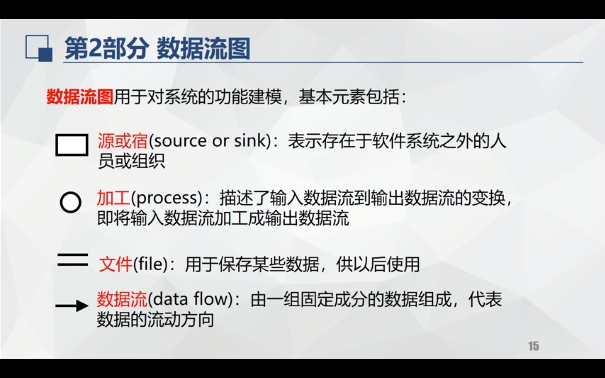

## chapter 01
- add some package.json command
- ==>
---

## chapter 02
- 

---

## Introd
- directory should correct absoulty
---

## bugs
- github actions
---

## canvets
- add token and to your repository secrect

```git
git clone xxx.git
```
